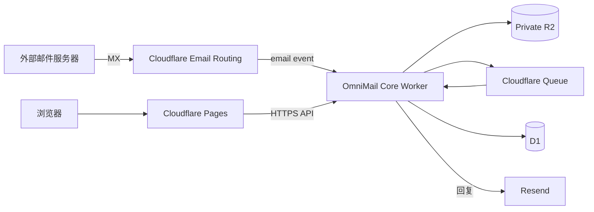

# OmniMail

OmniMail 是一个适合个人或小规模使用的域名 Webmail。前端部署在 Cloudflare
Pages，Core Worker 负责密码登录、邮件 API、Cloudflare Email Routing 收件和
队列解析，邮件索引存入 D1，原始邮件与附件存入私有 R2，回复通过 Resend 发送。

本仓库为 Git 驱动部署设计：Pages 和 Worker 都连接同一个 GitHub 仓库，推送到
生产分支后由 Cloudflare 自动构建和发布，不需要在本地执行部署命令。

## 当前功能

- Worker 配置驱动的唯一主管理员身份
- 邮箱地址 + 密码登录
- 桌面客户端 Access/Refresh Token、设备会话和 Bearer 鉴权
- 主管理员、管理员、普通用户和临时用户角色模型
- 管理员统计、用户管理与系统设置工作区
- 管理员操作日志、登录安全记录、筛选与游标分页
- 全站收件趋势、来源域名与高频发件人统计
- 管理员创建账号、调整角色、邮箱额度和邮件能力
- 管理员生成限时临时用户注册链接，可选择单次或多人使用
- 临时账号独立有效期、到期自动停用和用户自助删除
- 管理员集中维护可创建邮箱的启用域名
- 用户封禁、解封及封禁后的即时会话失效
- 多域名、多邮箱地址分组与聚合查看
- 邮件、用户与临时邀请列表的稳定游标分页
- 按域名或单个邮箱筛选邮件
- 获授权用户新增、停用和重新启用自己的邮箱地址
- 收件箱、星标、已发送和垃圾箱
- HTML / 纯文本邮件查看
- 私有附件及原始 `.eml` 下载
- Cloudflare Queue 异步解析邮件
- Resend 线程内回复
- 亮色、暗色及跟随系统的主题偏好
- 桌面三栏、平板及手机响应式布局
- 登录限速、HttpOnly 会话、用户级数据隔离和审计记录

第一版不包含无邀请公开注册、普通或管理员账号删除、IMAP、POP3、通讯录、群发和完整反垃圾系统。

## 架构



仓库结构：

```text
src/                    React Webmail
public/                 Pages 静态资源与安全响应头
email-worker/src/       API、登录、收件和队列消费者
email-worker/wrangler.jsonc
migrations/             可审阅的 D1 初始结构
.github/workflows/      GitHub CI（不负责生产部署）
```

Worker 会在首次请求或邮件事件到达时幂等初始化 D1 表结构。Wrangler 4 的自动
资源配置会在第一次 Git 部署时创建 D1 和 R2；队列使用
`omnimail-mail`，死信队列使用 `omnimail-mail-dead`。

## 部署前准备

你需要：

- 一个 GitHub 仓库
- DNS 已托管在 Cloudflare 的域名
- Cloudflare Workers & Pages 账户
- 可选的 Resend 账户（不配置时只隐藏“回复”功能，不影响收件）

低流量测试可以从 Workers Free 开始；生产环境推荐 Workers Paid，因为大附件解析和
高强度密码派生可能超过 Free 计划较紧的 CPU 时间预算。

如果根域名已经有其他邮箱服务，不要直接替换现有 MX。请先在 Cloudflare Email
Routing 中为专用子域启用收件，例如 `inbox.example.com`。

生产环境建议使用同一主域下的两个地址：

```text
Webmail: https://mail.example.com
API:     https://api-mail.example.com
```

这样登录 Cookie 保持 same-site。直接组合 `pages.dev` 与 `workers.dev` 属于跨站
环境，不适合作为正式登录地址。

## 1. 上传到 GitHub

在本地初始化 Git 仓库并推送到你自己的 GitHub：

```powershell
git init
git add .
git commit -m "Initial OmniMail"
git branch -M main
git remote add origin https://github.com/YOUR_NAME/omnimail.git
git push -u origin main
```

`.dev.vars`、`.env.local`、依赖目录和构建产物已经被忽略，不会上传密钥。

## 2. 连接 Core Worker

1. 打开 Cloudflare Dashboard → **Workers & Pages**。
2. 选择 **Create application → Import a repository**。
3. 授权 GitHub 并选择 OmniMail 仓库。
4. Worker 名称填写 `omnimail-core`，必须与
   `email-worker/wrangler.jsonc` 中的 `name` 一致。
5. Production branch 选择 `main`。
6. Root directory 保持仓库根目录 `/`。
7. Build command 可留空。
8. Deploy command 填写：

   ```text
   npx wrangler deploy -c email-worker/wrangler.jsonc
   ```

9. 保存并等待第一次构建。Cloudflare 会自动建立 D1、R2 与队列绑定。

然后进入 Worker → **Settings → Variables & Secrets**，配置：

| 名称 | 类型 | 必需 | 示例 |
| --- | --- | --- | --- |
| `SETUP_TOKEN` | Secret | 是 | 至少 32 字节随机值 |
| `SUPER_ADMIN_EMAIL` | Text | 是 | `owner@example.com` |
| `APP_ORIGINS` | Text | 是 | `https://mail.example.com` |
| `APP_NAME` | Text | 否 | `OmniMail` |
| `COOKIE_SECURE` | Text | 否 | `true`，生产默认即为 true |
| `RESEND_API_KEY` | Secret | 回复时 | `re_...` |
| `RESEND_FROM` | Text | 否 | `OmniMail <reply@example.com>` |

`APP_ORIGINS` 可以用英文逗号配置多个精确来源，但不要填写 `*`。
`SUPER_ADMIN_EMAIL` 是登录身份，不要求属于 Cloudflare Email Routing 域名。
如果以后修改它，OmniMail 会把现有主管理员账号迁移到新邮箱，继续使用原密码；
收件邮箱地址和历史邮件不会改变。

在 Worker 的 **Settings → Domains & Routes** 添加：

```text
api-mail.example.com
```

## 3. 连接 Cloudflare Pages

1. Workers & Pages → **Create application → Pages → Connect to Git**。
2. 选择同一个 GitHub 仓库。
3. Project name 填写 `omnimail`。
4. Production branch 选择 `main`。
5. Root directory 保持 `/`。
6. Build command 填写 `npm run build`。
7. Build output directory 填写 `dist`。
8. 在构建环境变量中添加：

   ```text
   VITE_API_ORIGIN=https://api-mail.example.com
   ```

9. 保存并部署，然后把 `mail.example.com` 添加为 Pages Custom Domain。

以后每次推送到 `main`，Cloudflare 会分别自动更新 Pages 和 Core Worker。Pull
Request 会得到 Pages 预览与 Worker 构建检查，但正式邮箱仍应使用自定义域名。

## 4. 启用 Cloudflare Email Routing

1. Dashboard → **Compute → Email Service → Email Routing**。
2. 为准备收件的域名或子域执行 Onboard。
3. 确认 Cloudflare 生成的 MX、SPF 和 DKIM 记录。
4. 新建 Catch-all 规则。
5. Action 选择 **Send to a Worker**。
6. Worker 选择 `omnimail-core`。

每个需要收件的域名或子域都要完成一次 Email Routing Onboard，并把 Catch-all
指向同一个 `omnimail-core`。OmniMail 会根据完整收件地址把邮件归入对应邮箱。

OmniMail 并不会保存所有 Catch-all 邮件。只有 D1 中已启用的邮箱地址会被接受，
其他地址会在 SMTP 阶段返回 `Mailbox unavailable`。

首次打开 `https://mail.example.com` 时填写：

- 显示名称
- 至少 10 个字符的密码
- Worker 中配置的 `SETUP_TOKEN`

页面会只读显示 Worker 中的 `SUPER_ADMIN_EMAIL`。完成后该地址成为主管理员登录
账户，但不会自动成为收件地址。登录后先在“系统设置 → 域名管理”添加收件域名，
再从“当前邮箱 → 管理邮箱地址”创建第一个邮箱，该地址会自动成为主收件地址。

## 多域名与多邮箱

登录后，点击邮件列表顶部的“当前邮箱”即可选择：

- 所有邮箱
- 某个域名下的全部邮箱
- 单个完整邮箱地址

管理员在“系统设置 → 域名管理”维护允许创建邮箱的域名。停用后不能继续创建新邮箱，
已有邮箱和历史邮件不受影响。删除操作只移除 OmniMail 的域名管理配置，并使使用该
域名的临时邀请链接失效；已有邮箱、邮件和附件会继续保留，也不会自动修改
Cloudflare Email Routing、MX 或其他 DNS 记录。

拥有创建邮箱权限的用户可以在选择面板底部进入“管理邮箱地址”，填写邮箱前缀并从
已启用域名中选择后缀。普通用户和临时用户还会受到管理员设置的创建权限与邮箱额度
限制。停用邮箱只会停止接收新邮件，历史邮件仍然保留；首个主邮箱不能停用。

在 OmniMail 中添加新域名地址之前，仍需先在 Cloudflare 为该域名启用 Email
Routing。OmniMail 负责地址授权与邮件归类，不会代替 Cloudflare 修改 DNS 或 MX。

## 用户角色

- `super_admin`：由 `SUPER_ADMIN_EMAIL` 唯一确定，可以管理所有非主管理员账户，
  也是唯一可以授予或撤销普通管理员角色的身份。
- `admin`：可以查看用户列表，并创建、设置、封禁或解封普通用户和临时用户；
  不能修改自己、其他管理员或主管理员。
- `user`：普通用户，具体邮箱额度、创建邮箱权限与回信权限由管理员设置。
- `temporary`：由管理员直接创建或通过限时邀请链接注册，使用管理员预设的邮箱额度、
  创建邮箱权限与回信权限。

管理员左侧会显示“统计”“用户”“系统设置”和“账号设置”。用户管理支持：

- 创建邮箱密码账户；
- 在普通用户、临时用户和管理员之间调整角色；
- 设置每个账户可拥有的邮箱数量，范围为 0–100；
- 单独控制创建/管理收件邮箱与 Resend 回信权限；
- 封禁或重新启用登录。封禁会立即删除该用户全部会话，但保留邮箱和历史邮件。

主管理员不能在网页端被降级或封禁。第一版仅允许临时用户删除自己的登录账号；
普通用户、管理员和主管理员均不提供网页删除。

## 临时用户邀请

管理员可在“用户 → 临时邀请”中选择两种邮箱分配方式：

- 管理员指定邮箱：管理员填写邮箱前缀并选择已启用的域名，完整地址在邀请有效期间
  会被预留。访问者只设置显示名称与密码；注册后固定使用该邮箱，不能自行新增或更改。
- 用户自选邮箱：管理员选择已启用的域名后缀，访问者注册时填写尚未使用的邮箱前缀；
  Worker 会在提交时再次校验完整地址是否被占用。

两种方式生成的完整邮箱都会同时成为登录账号和首个主收件地址。

- 单次使用：首个用户成功注册后链接立即失效，适合单独发送给一个人。
- 多人注册：仅适用于用户自选邮箱，同一个链接在有效期内可供多人分别注册，第一版
  不另设人数上限。
- 链接有效期只控制何时还能注册；链接到期或被撤销不会影响已创建的账号和邮箱。
- 临时账号有效期从每位用户注册成功时分别开始计算。到期后账号自动停用、会话失效，
  但邮箱地址、已有邮件和附件继续保留。
- 临时用户也可以在“账号设置”中输入当前密码并确认后提前删除自己的登录账号；
  该操作同样保留邮箱地址、已有邮件和附件。
- 管理员可预设是否允许继续添加邮箱、邮箱总数上限和 Resend 回信权限。

邀请令牌的明文只在创建成功时显示一次，D1 仅保存 SHA-256 摘要；邀请历史可以查看
域名、有效期、使用次数和状态，但不能重新获取原链接。若链接丢失，可撤销后重新生成。

## 5. 配置 Resend 回复

1. 在 Resend 添加并验证你的发信域名。
2. 按 Resend 给出的内容在 Cloudflare DNS 中添加 SPF 和 DKIM。
3. 创建仅允许 Sending 的 API Key，并尽量限制到这个发信域名。
4. 把 API Key 写入 Worker Secret `RESEND_API_KEY`。
5. 可选设置 `RESEND_FROM`。不设置时使用当前收件地址作为 From。

使用多个发信域名时，需要在 Resend 中分别验证这些域名。建议不设置全局
`RESEND_FROM`，这样回复会自动使用原邮件对应的邮箱地址。

回复会携带原邮件的 `In-Reply-To` 和 `References`，并使用 Resend
`Idempotency-Key` 防止重复点击产生重复发送。

## 本地开发

要求 Node.js 20+。

```powershell
npm install
Copy-Item email-worker/.dev.vars.example email-worker/.dev.vars
Copy-Item .env.example .env.local
```

终端一：

```powershell
npm run dev:worker
```

终端二：

```powershell
npm run dev
```

打开 `http://localhost:5173`。本地 D1、R2 和 Queue 数据会保存在
`.wrangler/`，不影响生产环境。

常用检查：

```powershell
npm run check:lines
npm run check
npm test
npm run build
npx wrangler deploy -c email-worker/wrangler.jsonc --dry-run
```

最后一条只做本地打包验证，不会部署。
仓库中的手写代码、测试和配置文件均限制在 600 行以内；`npm run check` 与 CI
都会执行这一检查。自动生成的 `package-lock.json` 不计入限制。

桌面端和第三方客户端接入方式、令牌轮换及分页响应格式见
[OmniMail HTTP API](docs/API.md)。

## 安全说明

- 密码使用 Web Crypto PBKDF2-SHA256（210,000 次）和独立随机盐。
- 浏览器会话仅通过 `HttpOnly + Secure + SameSite=Lax` Cookie 传递。
- 桌面设备使用 15 分钟 Access Token 与 30 天轮换 Refresh Token，D1 只保存摘要。
- 登录失败按 IP 与邮箱组合限速。
- 重要操作写入 D1 审计日志；密码、Token、Secret 和 Cookie 不进入日志详情。
- 主管理员身份由 Worker 的 `SUPER_ADMIN_EMAIL` 决定，网页端不能修改。
- 用户封禁后会立即清除该用户全部服务端会话，邮箱和历史邮件不会删除。
- 临时账号到期或自助删除采用逻辑删除，不触发邮箱、邮件和附件的级联删除。
- 普通管理员不能修改自己、其他管理员或主管理员，也不能授予管理员角色。
- API 只允许 `APP_ORIGINS` 中的精确来源并校验写请求来源。
- R2 Bucket 不应设置为公开；附件必须通过鉴权 API 下载。
- HTML 邮件在无脚本、无表单、无远程网络权限的 sandbox iframe 中显示。
- 远程图片默认阻止，避免追踪像素泄露读信状态。
- `SETUP_TOKEN`、`RESEND_API_KEY` 只能放在 Cloudflare Secrets，不能提交 Git。

## License

MIT
