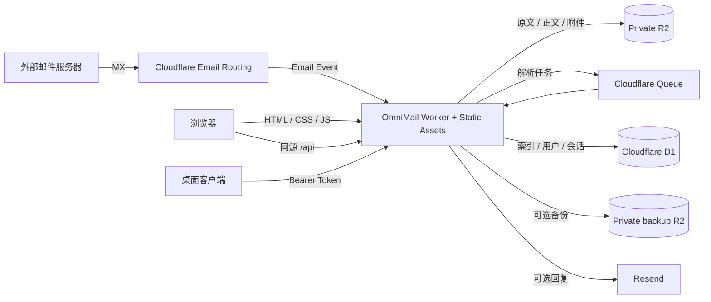

<p align="center">
  
</p>

<h1 align="center">OmniMail</h1>

<p align="center">
  基于 Cloudflare 构建的轻量、自托管、多域名 Webmail。
  <br>
  Git 驱动部署，邮件数据保留在你自己的 Cloudflare 账户中。
</p>

<p align="center">
  <a href="https://github.com/mibgb65-cloud/OmniMail/actions/workflows/ci.yml">
    
  </a>
  <a href="./LICENSE">
    
  </a>
  
  
  
</p>

> [!IMPORTANT]
> OmniMail 当前处于 **Alpha / 0.x** 阶段，适合个人、小团队和测试环境。
> 在承载重要邮件前，请完成独立安全审查、备份方案和真实邮件链路测试。

## 目录

- [为什么选择 OmniMail](#为什么选择-omnimail)
- [功能概览](#功能概览)
- [技术架构](#技术架构)
- [快速部署](#快速部署)
- [首次初始化](#首次初始化)
- [用户与权限](#用户与权限)
- [API 与桌面客户端](#api-与桌面客户端)
- [本地开发](#本地开发)
- [安全模型](#安全模型)
- [限制与路线图](#限制与路线图)
- [贡献](#贡献)
- [许可证](#许可证)

## 为什么选择 OmniMail

OmniMail 面向已经将域名托管在 Cloudflare、希望拥有独立域名邮箱工作台的用户。
它不是传统 IMAP 邮箱服务器，而是一套围绕 Cloudflare Email Routing 构建的
Serverless Webmail：

| 特点 | 说明 |
| --- | --- |
| 数据归属自己 | D1、R2、Queue 和 Worker 都运行在你的 Cloudflare 账户中 |
| 一体化 Git 部署 | 一次构建同时发布 React 静态前端与 Worker API |
| 多域名与多邮箱 | 一个实例统一管理多个域名、用户和收件地址 |
| 完整权限模型 | 主管理员、管理员、普通用户和限时临时用户 |
| 可选回信能力 | 通过 Resend 回复；不配置时仍可正常收件 |
| Web 与桌面共用 API | 浏览器使用安全 Cookie，桌面客户端使用 Access / Refresh Token |
| 管理可观测性 | 收件统计、来源分析、操作日志和部署自检 |

## 功能概览

### 邮件

- Cloudflare Email Routing + Catch-all 收件
- 可选无人收件：未创建地址的邮件统一进入主管理员收件箱
- Cloudflare Queue 异步解析，避免阻塞收件事件
- 收件箱、星标、已发送和垃圾箱
- 标准邮件头驱动的会话线程视图与最多 50 封批量操作
- HTML / 纯文本正文查看
- 私有附件与原始 `.eml` 下载
- 按域名、邮箱地址、发件人和主题筛选
- 稳定游标分页、自适应自动刷新与跨标签页轮询合并
- Resend 线程内回复及幂等发送

### 多域名与用户

- 多域名集中管理，支持启用、停用和安全删除
- 每个域名可创建多个独立邮箱地址
- 用户级邮箱额度、创建权限和回信权限
- 用户级存储配额与空间使用统计
- 用户封禁、解封及会话即时失效
- 管理员指定邮箱或用户自选前缀的普通/临时用户邀请
- 临时账号独立有效期、到期停用和延迟数据清理

### 管理与安全

- 邮箱密码登录和 Worker 配置驱动的主管理员
- 可选外部注册、Cloudflare Turnstile 与注册限速
- 注册邮箱后缀允许列表 / 禁止列表
- 短期 Access Token、轮换 Refresh Token 和设备会话
- 登录与敏感操作审计日志
- 收件趋势、来源域名与高频发件人统计
- 亮色、暗色及跟随系统主题
- 简体中文与英文界面，支持浏览器语言识别和手动切换
- 首次运行检查和三步部署初始化向导
- 管理员可选 D1 / 邮件归档备份、保留周期、存储统计与安全批量清理
- 桌面、平板和手机响应式布局

## 技术架构



| 层级 | 技术 |
| --- | --- |
| Web | React、TypeScript、Vite |
| API | Cloudflare Workers、Hono |
| 数据库 | Cloudflare D1 |
| 对象存储 | Cloudflare R2 |
| 异步任务 | Cloudflare Queues |
| 收件 | Cloudflare Email Routing |
| 回信 | Resend（可选） |
| 防护 | Cloudflare Turnstile（开放注册或多人邀请时） |

### 仓库结构

```text
.
├── src/                       # React Webmail
├── public/                    # Worker Static Assets 与安全响应头
├── email-worker/
│   ├── src/                   # API、收件、队列与定时任务
├── migrations/                # 可审阅的 D1 迁移
├── docs/API.md                # HTTP API 文档
├── scripts/                   # 仓库质量检查脚本
├── wrangler.jsonc             # Worker、静态前端与 Cloudflare 资源配置
└── .github/workflows/ci.yml   # GitHub Actions
```

## 快速部署

### 前置条件

- Cloudflare 账户，以及已托管在 Cloudflare DNS 的域名
- GitHub 账户
- Node.js 22+（仅本地开发需要）
- Resend 账户（可选，仅用于回复）

> [!TIP]
> 如果根域名已经承载其他邮件服务，建议先使用专用子域测试，例如
> `inbox.example.com`，不要直接替换现有 MX 记录。

前端和 API 使用同一个 Worker 域名：

```text
Webmail + API  https://mail.example.com
API path       https://mail.example.com/api/*
```

同源部署不需要额外的 Pages 项目或独立 API 域名，登录 Cookie 和 CORS 配置也更简单。

### 1. Fork 仓库

Fork [mibgb65-cloud/OmniMail](https://github.com/mibgb65-cloud/OmniMail)，
然后让 Cloudflare Worker 连接你的 Fork。

如果使用本地 Git：

```bash
git clone https://github.com/YOUR_NAME/OmniMail.git
cd OmniMail
```

### 2. 连接 Cloudflare Worker

在 Cloudflare Dashboard 中进入 **Workers & Pages → Create application →
Import a repository**，选择你的 OmniMail 仓库：

| 项目 | 值 |
| --- | --- |
| Project name | `omni-mail` |
| Production branch | `main` |
| Root directory | `/` |
| Build command | `npm run build` |
| Deploy command | `npx wrangler deploy` |
| Non-production branch builds | 首次部署暂时关闭 |
| API token | 让 Cloudflare 自动创建 |

第一次部署会依据
[`wrangler.jsonc`](./wrangler.jsonc) 完成两件事：

1. `npm run build` 将 React 前端生成到 `dist/`。
2. Wrangler 将 `dist/`、Worker API、D1、R2、Queue 和定时任务作为同一个
   Worker 版本发布。

`/api/*` 优先交给 Worker 脚本，其余路径由 Static Assets 提供；未匹配的浏览器
导航会回退到 `index.html`，因此 React SPA 刷新不会出现 404。

### 3. 配置 Worker

#### 必需配置

| 名称 | 类型 | 用途 | 示例 |
| --- | --- | --- | --- |
| `SETUP_TOKEN` | Secret | 首次创建主管理员的一次性令牌 | 至少 32 字节随机值 |
| `SUPER_ADMIN_EMAIL` | Text | 主管理员登录邮箱 | `owner@example.com` |

#### 可选配置

| 名称 | 类型 | 用途 |
| --- | --- | --- |
| `APP_NAME` | Text | 自定义站点名称，默认 `OmniMail` |
| `COOKIE_SECURE` | Text | 生产环境保持 `true`；仅本地 HTTP 使用 `false` |
| `APP_ORIGINS` | Text | 允许访问 API 的额外跨域前端来源 |
| `TURNSTILE_SITE_KEY` | Text | Turnstile 公开 Site Key |
| `TURNSTILE_SECRET_KEY` | Secret | Turnstile 私密 Secret Key |
| `RESEND_API_KEY` | Secret | Resend 回复 |
| `RESEND_FROM` | Text | 可选固定发件人，例如 `OmniMail <reply@example.com>` |
| `CLOUDFLARE_ACCOUNT_ID` | Text | 可选备份所需的 Cloudflare Account ID |
| `D1_DATABASE_ID` | Text | 可选备份所需的生产 D1 Database ID |
| `D1_REST_API_TOKEN` | Secret | 可选备份所需、仅授予 D1 Read 的专用 API Token |

同一个 Worker 提供的前端会被自动允许，不需要设置 `APP_ORIGINS`。只有另一个
Web 前端需要跨域调用 API 时才配置它；支持英文逗号分隔的精确来源，不能使用 `*`。
Secret 只能保存在 Cloudflare Variables & Secrets，不要写入 GitHub 仓库。

### 备份、保留与配额

生产部署可绑定独立私有 R2 Bucket `omni-mail-backups`。配置上表三个备份变量后，
管理员可以在 **系统设置 → 备份、保留与配额** 中自行开启或关闭备份；资源不完整时
开关会保持不可用，不会显示虚假的成功状态。

- 开启时每日导出 D1，并将新收邮件原文和已发送正文归档到备份桶。
- D1 每日、每周、每月备份默认分别保留 30、84、365 天，邮件归档保留 90 天。
- 垃圾箱、失败邮件、临时账号数据和操作日志保留期由管理员设置。
- 普通用户和临时用户有独立默认空间配额；单个账号可在用户管理中覆盖，垃圾箱内
  邮件在永久清理前仍计入配额。

`D1_REST_API_TOKEN` 应使用独立的 Cloudflare API Token，只授予目标账户的
**D1 Read** 权限。恢复前先下载备份对象并导入一个新的 D1 数据库完成校验，再切换
绑定；不要直接覆盖正在运行的生产数据库。R2 邮件归档用于灾难恢复，不替代原始
邮件桶，也不应设置为公开访问。

在 Worker 的 **Settings → Domains & Routes** 添加 Webmail 自定义域名：

```text
mail.example.com
```

生产构建不需要设置 `VITE_API_ORIGIN`，前端默认使用同源 `/api`。

### 4. 启用 Email Routing

对每个收件域名执行以下操作：

1. 打开 **Cloudflare Email Routing** 并完成域名 Onboard。
2. 确认 Cloudflare 生成的 MX、SPF 和 DKIM 记录。
3. 创建 Catch-all 规则。
4. Action 选择 **Send to a Worker**。
5. Worker 选择 `omni-mail`。

OmniMail 只接受数据库中已经创建并启用的完整邮箱地址。其他 Catch-all 地址会在
SMTP 阶段返回 `Mailbox unavailable`，不会被写入 R2 或 D1。

## 首次初始化

打开 Worker 地址后，首次运行页会检查：

- D1 数据库
- R2 邮件存储
- 邮件解析队列
- `SUPER_ADMIN_EMAIL`
- `SETUP_TOKEN`

全部就绪后，填写显示名称、主管理员密码和 `SETUP_TOKEN`。创建成功后会自动进入
三步部署向导，继续检查核心资源、身份安全和邮件服务。

部署向导只返回配置状态，不返回 Secret 或环境变量值。Cloudflare Email Routing
状态无法由当前 Worker 直接读取，因此需要管理员人工确认。以后可从
**系统设置 → 主管理员 → 部署初始化向导** 重新运行。

初始化完成后：

1. 在 **系统设置 → 域名管理** 添加收件域名。
2. 在 **当前邮箱 → 管理邮箱地址** 创建第一个邮箱。
3. 给该地址发送测试邮件，确认 Email Routing、Queue、D1 和 R2 链路。
4. 不再需要重新初始化时，可以删除 Worker 中的 `SETUP_TOKEN`。

## 用户与权限

| 角色 | 能力 |
| --- | --- |
| `super_admin` | 唯一主管理员；管理全部非主管理员账户并授予管理员角色 |
| `admin` | 用户、邀请、域名、统计、日志与系统设置；不能修改管理员或主管理员 |
| `user` | 按管理员设置的额度使用邮箱、创建地址和回复 |
| `temporary` | 限时账户；权限与邮箱由邀请或管理员预设 |

主管理员身份始终由 Worker 的 `SUPER_ADMIN_EMAIL` 决定，不能在网页端被降级或
封禁。修改该变量后，系统会把已有主管理员身份迁移到新邮箱，不会改变原密码、
收件地址或历史邮件。

### 用户邀请模式

- **管理员指定邮箱**：邀请创建时预留完整地址；注册后不能自行更改。
- **用户自选邮箱**：管理员固定域名后缀，用户注册时填写未占用的前缀。
- **单次使用**：第一个用户注册成功后立即失效。
- **多人注册**：同一链接有效期内允许多个用户分别注册，必须配置 Turnstile。
- **普通用户**：账号注册后长期有效，使用系统配置的普通用户默认配额。
- **临时用户**：账号按邀请设置的时长有效，使用临时用户默认配额。

邀请过期只阻止继续注册，不影响已经创建的账号。临时账号到期或用户主动删除后，
登录账号会立即停用，邮箱地址、历史邮件与附件会在管理员设置的保留期结束后清理。

## API 与桌面客户端

OmniMail 的 Web 和桌面客户端共用同一套 JSON API：

- 浏览器：`HttpOnly + Secure + SameSite=Lax` Cookie
- 桌面客户端：15 分钟 Access Token + 30 天轮换 Refresh Token
- 分页：稳定游标，不依赖可变页码
- 下载：附件和 `.eml` 使用鉴权 API，不暴露 R2 公共地址

完整接口、鉴权、刷新令牌和分页格式见
[`docs/API.md`](./docs/API.md)。

## 本地开发

### 安装

```powershell
npm install
Copy-Item email-worker/.dev.vars.example email-worker/.dev.vars
Copy-Item .env.example .env.local
```

编辑 `email-worker/.dev.vars` 后启动两个终端：

```powershell
# Terminal 1: Worker API
npm run dev:worker
```

```powershell
# Terminal 2: React Web
npm run dev
```

访问 `http://localhost:5173`。本地 D1、R2 和 Queue 数据保存在 `.wrangler/`，
不会影响生产环境。

### 质量检查

```powershell
npm run check:lines
npm run check
npm test
npm run test:e2e
npm run build
npx wrangler deploy --dry-run
```

最后一条命令只执行 Worker 打包验证，不会部署。CI 会在每次 Push 和 Pull Request
中运行测试、类型检查、生产构建与 Wrangler dry-run。

项目要求手写代码、测试和配置文件单文件不超过 600 行。自动生成的依赖锁文件和
Wrangler 构建产物不计入限制。

## 安全模型

- 密码使用 Web Crypto PBKDF2-SHA256、100,000 次迭代和独立随机盐（Cloudflare
  Workers 运行时当前支持的上限）。
- 浏览器会话只通过安全 Cookie 传递。
- Access Token 短期有效，Refresh Token 轮换并仅保存摘要。
- 登录、公开注册和邀请注册均有限速保护。
- 开放注册和多人邀请使用 Turnstile 服务端校验。
- API 自动允许当前 Worker 同源请求；额外跨域来源必须在 `APP_ORIGINS` 中精确配置。
- R2 Bucket 必须保持私有，文件只能通过鉴权 API 下载。
- HTML 邮件在禁止脚本、表单和远程网络的 sandbox iframe 中显示。
- 远程图片默认阻止，降低追踪像素泄露风险。
- 无人收件默认关闭；开启后仅接收已管理且启用域名下的未分配邮件。
- 密码、Token、Cookie 和 Secret 不会进入操作日志。
- 封禁用户会立即撤销其服务端会话。

> [!WARNING]
> OmniMail 不是端到端加密邮箱，也不能替代专业反垃圾、归档、合规或灾难恢复系统。
> 自托管意味着你需要自行负责 Cloudflare 账户安全、域名续费、备份和邮件可达性。

安全问题请不要公开提交包含利用细节、生产地址或密钥的 Issue。可以先创建不含敏感
信息的说明，或通过仓库所有者公开提供的私密联系方式报告。

## 限制与路线图

### 当前不提供

- IMAP / POP3 / SMTP 客户端兼容
- 新邮件撰写、群发、转发和通讯录
- 完整反垃圾、病毒扫描和邮件规则引擎
- 自动修改 Cloudflare DNS、MX 或 Email Routing
- 跨实例一键迁移与自动恢复
- 面向大型组织的合规归档和高可用保证

### 后续方向

- 稳定并版本化 `/api/v1`
- 桌面客户端与增量同步
- 邮件全文搜索与新邮件通知
- 可视化备份浏览、下载与恢复演练
- 更细粒度的 Token Scope 与管理策略

路线图会根据实际使用反馈调整。欢迎通过
[Issues](https://github.com/mibgb65-cloud/OmniMail/issues)
提交缺陷、使用场景和功能建议。

## 贡献

欢迎 Issue 和 Pull Request。提交代码前请确保：

1. 修改范围聚焦，不提交无关格式化。
2. 新行为包含相应测试。
3. `npm test` 与 `npm run build` 通过。
4. 单个手写代码文件不超过 600 行。
5. 不提交 `.dev.vars`、`.env.local`、Token、邮件数据或其他敏感内容。

## 许可证

OmniMail 使用 [MIT License](./LICENSE)。

Copyright © 2026 OmniMail contributors.
